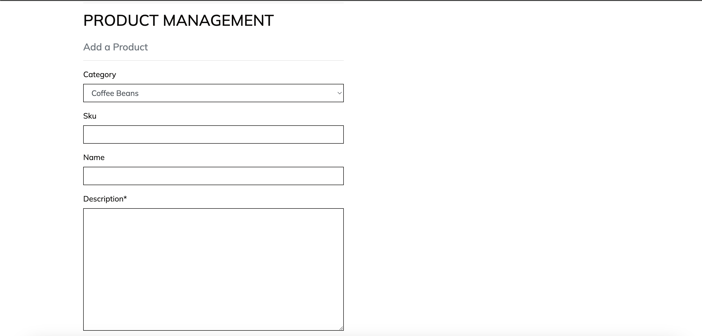

# **CosyCoffee**

## **Overview**

Cosycoffee is coffee roaster with an e-commerce website aimed to coffee lovers. On the website, the users can find several options of speciality coffee beans roasted by the company to buy and also accessories like filters, different brewing methods and others. Once they are logged in and they make their first purchase, their shipping details are attached to their profile, so they do not need to repeat that step on a second order. They also have the chance to sign up for the newsletter.

## Table of contents

- [**Cosy COffee**](#revforum)
  - [**Overview**](#overview)
  - [Table of contents](#table-of-contents)
  - [**Planning stage**](#planning-stage)
    - [**Target Audiences:**](#target-audiences)
    - [**User Stories:**](#user-stories)
    - [**Site Aims:**](#site-aims)
    - [**Marketing Strategy Implementation**](#marketing-strategy-implementation)
        - [*Branding*](#branding)
        - [*SEO*](#seo)
        - [*Keywords*](#keywords)
        - [*Newsletter*](#newsletter)
        - [*Social media*](#social-media)
    - [**Forum Structure:**](#forum-structure)
    - [**Current Features**](#current-features)
        - [*Main Screen:*](#main-screen)
        - [*Products page:*](#products-page)
        - [*Product detail page:*](#product-detail-page)
        - [*Recipes page:*](#recipes-page)
        - [*Recipe detail page:*](#recipe-detail-page)
        - [*Shopping cart page:*](#shopping-cart-page)
        - [*Secure checkout:*](#secure-checkout)
        - [*Profile page:*](#profile-page)
        - [*Producers page:*](#producers-page)
        - [*Products Management page:*](#product-management-page)
        - [*Producers Management page:*](#producers-management-page)
        - [*Recipes Management page:*](#recipes-management-page)
        - [*Footer:*](#footer-section)
        - [*404 page:*](#404-page)
  - [**Future-Enhancements**](#future-enhancements)
  - [**Testing Phase**](#testing-phase)
  - [**Validators**](#validators)
  - [**Bugs**](#bugs)
  - [**Deployment**](#deployment)
  - [**Tech**](#tech)
  - [**Credits**](#credits)
    - [**Honorable mentions**](#honorable-mentions)
    - [**Content:**](#content)

## **Planning stage**

### **Target Audiences:**

- Users interested in coffee.
- Users interested in coffee roasters.
- Users interested in speciality coffee.
- Users interested in a premium experience with coffee.
- Users interested in having good quality coffee at their own property.
- Users interested in making high quality coffee at home.
​

### **User Stories:**

- As a user, I want to sign up.
- As a user, I want to sign in.
- As a user, I want to sign out.
- As a user, I want to reset my password.
- As a user, I want to be able to modify my password if I am logged in.
- As a user, I want to see all the available coffees/accessories.
- As a user, I want to search all the available coffees/accessories.
- As a user, I want to see more details of each coffee/accessory.
- As a user, I want to add the coffee/accessory to the cart.
- As a user, I want to check my current shopping cart.
- As a user, I want to add or remove the quantity of items in the shopping cart.
- As a user, I want to add or remove items of the shopping cart.
- As a user, I want to know how much is order at any specific time.
- As a user, I want to add my shipping and billing addresses.
- As a user, I want to know how much would be the shipping cost.
- As a user, I want to add my payment details.
- As an admin, I want to add coffee/accessories to the website.
- As an admin, I want to update coffee/accessories information on the website.
- As an admin, I want to remove coffee/accessories from the website.
- As an admin, I want the orders made on website.
​

### **Site Aims:**

- To provide an e-commerce website for coffee aficionados.
- To provide the information clients interested in speciality coffee would be interested, such as origin, processing method, producer, etc.
- To provide a safe environment for users to buy coffee or coffee paraphernalia.
- To provide an excellent buying experience with information in all the steps of the buying process.
- To allow users to sign up to the Newsletter so they can be informed of any sales, promotions or new arrivals.

### **Marketing Strategy Implementation:**

#### *Branding:*
- Considering that coffee is a fruit and the thought of it reminds plantation, the base colours for the project were earth ones, with brown, black and white to geberate contract. For the font, Mulish was the one chosen: it is a clear, non-serif font, with sober identity that can provide easy ready.

#### *SEO:*
- The project was though in a way that any search engine could take advantage of any of the pages of the website. All of the texts in the website, specially the descriptions use keywords that would provide a better classification of the website for queries regading coffee roasters, coffee beans and any related searches.

#### *Keywords:*
- The head part of the website also contains the keywords relevate for the website. Keywords are living data. They can change: new ones can be added, others can be removed. So it is a study that needs to be done on a constantly basis. For this project, a search should be carried out every six months through plataforms like Google Ads to provide the best results.

#### *Newsletter:*
- As part of an objective of interacting with the clients of the website in the most engaging and personal way, a Newsletter subscription was created. That allows the users to opt-in for the emails where they can have access to the lastest offers and new products that are added to the website. It is a non-invasive marketing option, that only reaches out to people who are really interested in the company and/or products.

#### *Socialmedia:*
- Like the Newsletter, Social Media is a necessary point of contact for any company that wants not only to have clients but brandlovers. Brandlovers are especially important for situations for when crysis occur. They can be a way to prevent or to come back easily from a bad situtation, brandwise. Based on a BrandPersona study the best ones can be chosen. Since coffee has a lot to do with visual and feeling, Facebook, Instagram and Tiktok would be highly recommended.

### **Forum Structure:**
- There are three levels of access within the e-commerce. The first is the user who is not registered in the website. They can see the products, producers, search for products, the bag, have access to the footer and also access the page to login and signup. If the user is registered, they can have access to their profile page, with their previous orders and also the checkout page. The last level is superuser, the administrator of the website, who can add products and producers. They can also edit and delete on the products and producers page.

## **Current Features**

​

#### *Main Screen:*

- Main screen of the website. The page is divided in five main areas:
  . Banner with the threshold for free shipping.
  . Navigation bar with a search button for the products and profile access.
  . Quick links to the products: all products, coffee beans or accessories.
  . Carousel with the main products available.
  . Footer with connection to social media profiles.

#### *Products page:*

- Once the user/visitor clicks in one of the products links, the page of the products is shown. It provides the image, name, the price and the rate of the product.The page can also be filtered by microlot coffees and accessories.

#### *Product detail page:*

- When the user clicks at any of the products, they are redirect to the information of the product. They have more details of each product and can choose to add to their shopping cart the quantity they desire of the product.

#### *Recipes page:*

- The user also has access a some recipes that the e-commerce provides. Aiming to create a close relantionship with the customers, the idea is to promote coffee and also to provide the knowledge so that the customers can really enjoy the coffee they are acquiring.

#### *Recipe detail page:*

- Once the user accesses the page for the chosen brewing method, he has a table with contains what is needed prior to making the coffee, like amount of coffee, water, etc. They also have the information of how many cups that specific recipe would result. There is also a description on how to prepare the cup.

#### *Shopping cart page:*

- If the user clicks on the shopping cart at the navbar, the user can access their current order. They will have a list of the items, with their quantity, how much each individual item will cost and if they have free shipping or not. If they have not reached the threshold, the website inform the user how much more they need to add to the car to be able to have free delivery.

#### *Secure checkout:*

- When the user decides to make the payment, they are taken to the page where they can add their shipping/billing information. If they are not logged in, the website requests them to login or to sign up. They are not able to pay for an order without an account. This is a marketing decision, so that every sell can bring a new lead for the list of users and for the newsletter. Once the payment is finalised, they are informed that the order was made and that they will received an email with the confirmation soon.
 

#### *Profile page:*

- Once the user makes their first buy, their profile is automatically saved into their profile. However, the users can access and update all the details if necessary. The users also can access their previous order and check what they ordered.

#### *Product Management page:*

- Administradors of the page have access to the product management page. In this page, they can add new products to the website. To edit and delete products, the administrator can do through the products page. Each product has their own update and delete buttons.

#### *Producers Management page:*

- Like the page above, administradors of the page have access to add new producers to the website. They are connected to the coffee. So, whenever a new coffee product is added, the administrator can choose from one of the producers listed.

#### *Recipes Management page:*

- Like the previous ones, administradors of the page have access to add new recipes to the website.

#### *Footer section:*

- At the bottom of the page, users have the footer with a summary of the whole website and also access to the social media pages and the option to opt-in to the Newsletter.

#### *Privacy page:*

- The page also provides a legal text regarding Privacy. User can access and to the text and what would be the use of the data provided by the user, if it was a real website.

#### *404 page:*

- The website also has a custom 404 page if the user uses a link that does not exist.

## **Future-Enhancements**

​

- Users log through their social networks profiles (FB, X).
- Users leave their own ratings instead of the rates given by the company.
- Users be able to share their own coffee recipes.

​

## **Testing Phase**

​

Implementation: Create new category as admin.

Test: Access admin area and created new category.

Result: New category appeared on the website.
***

Implementation: Create new product.

Test: Access Product Management page and created new category.

Result: New product appeared on the website.
***

Implementation: Create new producer.

Test: Access Producers Management page and created new category.

Result: New producer appeared on the website.
***

Implementation: Update product.

Test: Access Product edit page and made modification.

Result: Modification appeared on the website.
***

Implementation: Update producer.

Test: Access Producer edit page and made modification.

Result: Modification appeared on the website.
***

Implementation: Delete product.

Test: Click delete button of a specific product.

Result: Product removed from the website.
***

Implementation: Delete producer.

Test: Click delete button of a specific producer.

Result: Producer removed from the website.
***

Implementation: Create new user.

Test: Accessed sign up page and input information.

Result: Email with confirmation sent and user created.
***

Implementation: Login to account.

Test: Accessed login page and input details.

Result: Access granted.
***

Implementation: 404 page.

Test: Accessed non-existing address within the website.

Result: Custom 404 page loaded.
***

Implementation: Shop microlot coffees.

Test: Click shop now button in index page.

Result: Products page filtered with microlot items.
***

## **Validators**

. Lighthouse 
All pages passed the Lighthouse check.

. W3C HTML Validator 

. W3C CSS Validator 

. Python Linter 

## **Bugs**

Problem 🐞: Add_to_bag view was not funcionting properly.

Cause🛠: Information being passed was not clear.

Resolution✅: Create hidden input button so the correct information could be retrieved.
***

Problem 🐞: Bag was not rendering correct the products.

Cause🛠: Item being added to bag incorrectly.

Resolution✅: Change view code.
***

Problem 🐞: Bag page would not show the price for the item.

Cause🛠: Product model contains the three possible prices, depending of the weight (if coffee) or if it is an accessory.

Resolution✅: Added MathFilters library to allow division to be applied in Django template.
***

Problem 🐞: Remove button would not remove item.

Cause🛠: Weight variable was being rewritten after being retrieved by the view.

Resolution✅: Removed variable being called.
***

Problem 🐞: Checkout success page not returning with the total.

Cause🛠: View and model were not handling the information being passed.

Resolution✅: Changed the dictionary being created to allow the information to be read properly.
***

Problem 🐞: 400 error with Stripe Webhook.

Cause🛠: SECRET_WH_KEY not added to scope.

Resolution✅: Added key to scope.
***

## **Deployment**

## **Tech**

- Python.
- Django.
- Javascript.
- Django-allauth.
- Pillow.
- Crispy-forms.
- Stripe.
- Mailchimp.
​

## **Credits**

### **Honorable mentions**

- Larissa Moura (my wife) - She was my tester and also my design guru.
- Richard Wells (my Code Institute tutor) - Help me throughout the project in all aspects.
​

### **Content:**

- Structure of the project (apps) based on the codealong project "Boutique Ado" from [CodeInstitute] (<https://github.com/Code-Institute-Org/boutique_ado_v1>)
- Search bag based on the simple bar example from [SliderRevolution] (<https://www.sliderrevolution.com/resources/css-search-box/>)
- Images of producers collected from [Freepik] (<https://www.freepik.com>)
- Images of acccessories taken from each company website
- Facebook mockup structure from [Unblast] (<https://unblast.com/free-facebook-page-mockup-2022-psd/>)
- SKUs made with [Zoho] (<https://www.zoho.com/inventory/sku-generator/>)
- Footer HTML based on the basic footer structure from [MDBootstrap] (<https://mdbootstrap.com/docs/b4/jquery/navigation/footer/>)
- Privacy Policy made with [TermsFeed] (<https://app.termsfeed.com/>)
